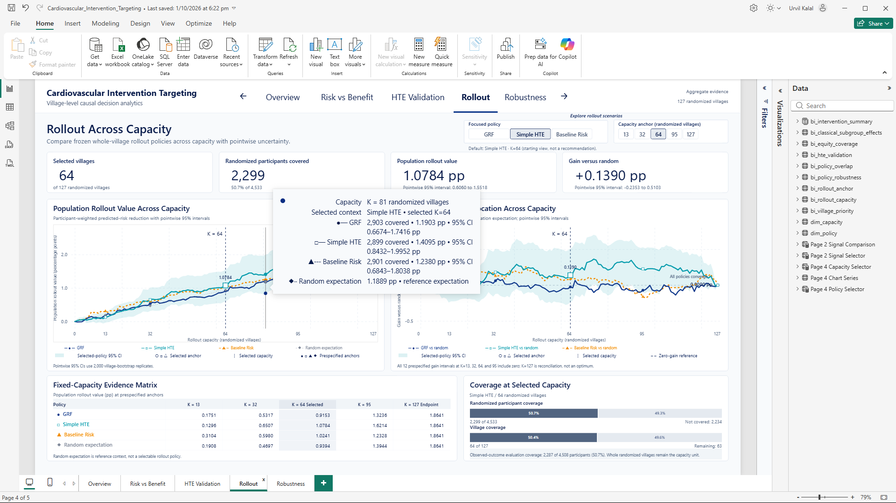

# Power BI implementation and public specification

The analysis was first implemented and validated as a five-page Power BI dashboard. The React/TypeScript application was subsequently implemented independently from the same validated analytical contracts and approved dashboard design; it was not exported or generated from Power BI.

Editable PBIX/PBIP/PBIR projects, semantic/model source, embedded model binaries, private analytical inputs and historical backups remain private. The public web implementation is fully inspectable. Public report outputs document the Power BI result without exposing editable internals or claiming complete public analytical reproducibility.

## Power BI Desktop evidence

Power BI Desktop: rollout analysis with capacity-level tooltip. Select the image to open the five-page proof PDF. The tooltip inspects K=81 while the selected dashboard anchor remains K=64.

[Power BI Desktop proof (five-page PDF)](../reports/CIT-PowerBI-Proof.pdf) packages user-supplied full-window screenshots in Overview, Risk vs Benefit, HTE Validation, Rollout and Robustness order. Ribbon, Data pane and page tabs establish Desktop context. The Rollout capture includes an open chart tooltip; Robustness includes a highlighted row. These static screenshots are additional implementation evidence, not editable report distribution, exhaustive interaction proof or a tagged accessible PDF. The existing clean final PDF and canonical screenshots below remain unchanged.

## Final approved report outputs

The [five-page PDF](../reports/Cardiovascular_Intervention_Targeting_final.pdf) is a static report export. These five clean final images demonstrate one approved state per page:

| Page | Final image | Contract |
| --- | --- | --- |
| Overview | [Overview](../reports/figures/powerbi/phase12b_final_20261001/page_01_overview.png) | Fixed randomized population, allocation, available-primary-outcome effect and 95% CI; no analytical selector. |
| Risk vs Benefit | [Risk vs Benefit](../reports/figures/powerbi/phase12b_final_20261001/page_02_risk_vs_benefit.png) | 127 anonymized villages; GRF/Simple HTE switches the frozen benefit signal on common axes, not the fixed correlations. Default GRF. |
| HTE Validation | [HTE Validation](../reports/figures/powerbi/phase12b_final_20261001/page_03_hte_validation.png) | AUTOC, calibration, participant-score agreement and 13 descriptive subgroup rows. Prioritization support does not demonstrate superiority. |
| Rollout | [Rollout](../reports/figures/powerbi/phase12b_final_20261001/page_04_rollout.png) | Full K=0-127 curves, frozen pointwise intervals, selected anchor values and coverage. Default Simple HTE/K=64; no optimal-capacity recommendation. |
| Robustness | [Robustness](../reports/figures/powerbi/phase12b_final_20261001/page_05_robustness.png) | Separate policy ranks/signals for all 127 villages, overlap, sensitivity and descriptive coverage. Default Simple HTE/K=64/Age/Focus rank ascending. |

The PDF/images show only visible rows and recorded states. They do not replace the interactive dashboard or prove every interaction. The native report retains all 127 village records. The PDF is untagged; accessible-PDF certification is not claimed.

## Analytical and implementation boundaries

The SMARTER village-cluster trial includes 4,533 randomized participants in 127 villages and 4,508 observed primary outcomes. The endpoint is predicted 10-year ASCVD risk, not observed cardiovascular events. The adjusted effect is approximately -1.880 percentage points (95% CI -2.564 to -1.196); lower values favor intervention. Available-primary-outcome analysis is not an unqualified full-population ITT claim.

Python/R owns estimation, out-of-village validation and village-level resampling. Power BI imports frozen aggregate results; Power Query applies supplied fields/types and DAX handles presentation selection/formatting, not re-estimation. No participant-level dataset is included in the public report outputs. Public anonymized village identifiers and aggregate counts are intentional.

Policy colors are GRF `#0B2E83`, Simple HTE `#0798A5` and Baseline Risk `#F28C00`, with labels and distinct graphical encodings supplementing color.

At K=127, rollout population value reconciles to approximately 1.8641 pp and gain versus random is zero. Page-5 capacity-specific robustness is not applicable at full capacity, while overlap and coverage still reconcile. Ranking agreement is not causal superiority; subgroup intervals are not interaction tests; descriptive coverage is not a fairness target. No single robust policy winner is established.

Local reconciliation checks 141 frozen targets and six exporter regressions. The public web build validates shipped JSON without private Power BI or analytical inputs. See [validation evidence and limitations](../docs/public/VALIDATION.md) for the distinction between automated checks, manual hosted review and unclaimed certification, and the [project README](../README.md#run-the-web-application-locally) for build instructions.

No open-source LICENSE has been authorized. Public availability of these outputs or documentation does not grant reuse rights to the private Power BI implementation or other project materials.
